<p align="center">
  
</p>

<h1 align="center">MAUI Inspector</h1>

<p align="center">
  <a href="https://www.nuget.org/packages/Immons.Tools.Maui.Inspector"></a>
  <a href="https://www.nuget.org/packages/Immons.Tools.Maui.Inspector"></a>
  <a href="https://www.nuget.org/packages/Immons.Tools.Maui.Inspector.Sync"></a>
  <a href="LICENSE"></a>
</p>

**Chrome DevTools for your .NET MAUI app.** Inspect and live-edit the visual tree, mock and
intercept HTTP traffic, and push the same edits to several devices at once — from a web panel
in your desktop browser, with an on-device overlay as the fallback when you have no laptop at hand.

Everything runs **inside your app**: no IDE integration, no proxy, no certificates.

- **Inspect & edit** the live visual tree — box model, properties, styles, spans, grids, `{Binding}` / `{StaticResource}` / `{OnPlatform}` — with every change written back to your XAML if you want it.
- **Edit the structure, WYSIWYG-style** — drag controls from a toolbox onto the live mirror, add / remove / reorder / reparent / wrap / unwrap / copy-paste elements with undo & redo, and it all lands in your `.xaml` files as real markup ([details](#structure-editing-wysiwyg)).
- **Intercept HTTP** — record traffic with bodies, mock it with rules and scenarios, record a whole flow and replay it offline, or pause a call at a breakpoint and edit it.
- **Drive several devices at once** — one panel updates the same app on every connected simulator, emulator or phone.

## The web panel

Turn it on with two lines (see [Getting started](#getting-started)), open the printed URL on your
desktop, and you get the full inspector in a browser — while the app runs on a simulator,
an emulator or a physical device.

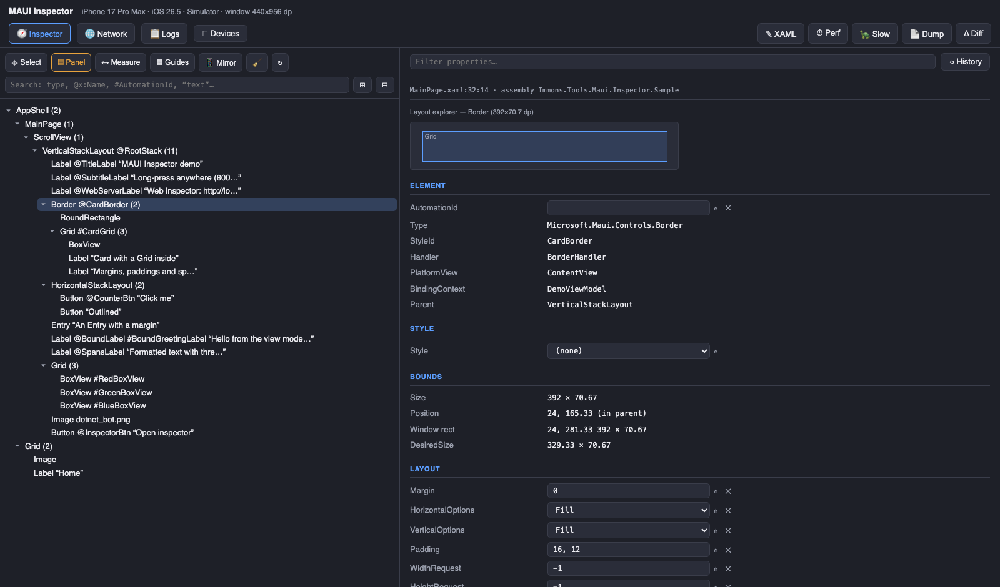

The right side of the header shows the device the panel is talking to, with a green dot while the
connection is alive. When the app stops, restarts on another port or loses its `adb forward`, the
dot turns red and the label reads `disconnected` — previously the panel kept accepting clicks that
quietly went nowhere. A third, amber state covers the case that looks identical from the outside:
iOS suspends a backgrounded app **including its HTTP server**, so requests neither succeed nor fail,
they simply never return. The panel times those out and says `app in background` instead of staying
green on stale data. The **Devices** view lists each target with its address and marks the ones
that no longer answer, with one button to drop them (ports are recycled between runs, so stale
entries accumulate).

The header shows which package build is running (`v0.9.12`) next to the title. The panel also asks
nuget.org for the newest published version and turns that into `v0.9.12 → 0.9.13 available` when you
are behind — a plain GET of a public index, silently skipped when there is no connection.

The tree, the property sheet and the device stay in sync both ways: click an element in the
browser and it highlights on the device; long-press on the device and the browser follows.
Property edits apply **live** — and, with the XAML Updater running, they are
[written back into your XAML sources](#wysiwyg-write-edits-back-to-your-xaml-xaml-updater).

**Network — requests, breakpoints and bodies**

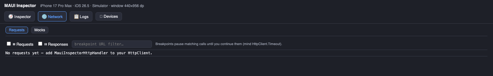

Every call that goes through `MauiInspectorHttpHandler` is recorded with full request and
response bodies (click a row to expand). Breakpoints pause matching requests or responses so you
can edit the body or status and continue — Proxyman-style, but inside the process, so TLS and
certificate pinning are none of your concern.

**Mocks — rules, scenarios and recording**

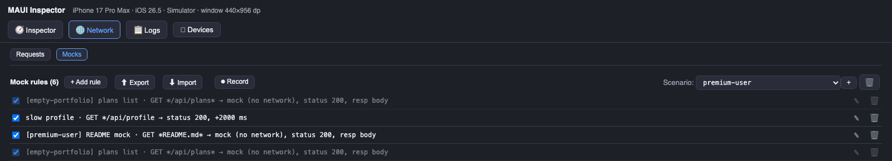

Rules match on method + URL pattern (the most specific rule wins) and can replace the request or
response body, force a status, add a delay, simulate a timeout or a network error, or answer
completely without the network. Group them into **scenarios** ("premium user", "empty portfolio",
"force update"), switch the active one from a picker, or hit **⏺ Record**, click through a flow and
turn the whole request path into a replayable scenario. Rules survive app restarts, so even
a version check fired on startup is already mocked.

**Other views:** **Logs** streams `ILogger` output, and **Devices** turns one panel into
multi-device hot reload — every edit, structural action and mock rule is mirrored to the same app
running on other simulators, emulators or physical devices, matched by XAML source identity
(so per-idiom / per-platform `DataTemplate`s stay correct).

## On the device

No laptop? The same inspector runs as an overlay inside the app — long-press anything to inspect it.

| Box model + properties | Visual tree | Per-platform editing |
| --- | --- | --- |
| 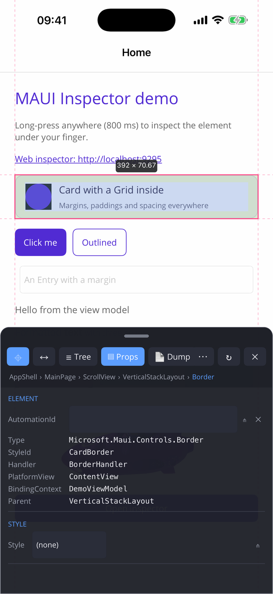 | 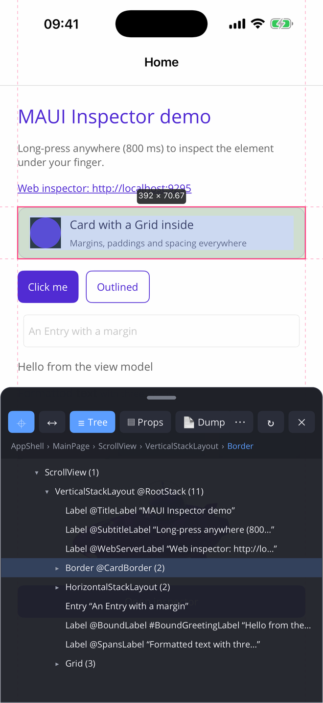 | 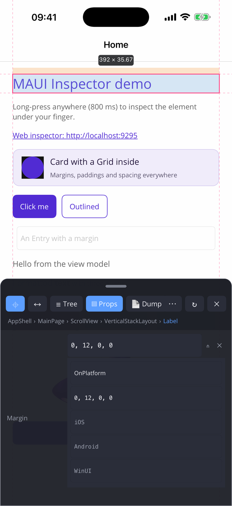 |

The on-device panel is feature-matched with the web one: live editors with `⋔` per-platform /
per-idiom composer, `✕` clear, `⛓︎`/`⋔︎` badges for bound and per-device values, and a `⋯` row with
**Guides**, **XAML** write-back, **Perf** and **Slow** toggles.

## Structure editing (WYSIWYG)

Properties are half the story — the inspector also edits the **structure** of a running page:
add controls, delete them, reorder, reparent, wrap and unwrap, copy & paste — live on the
device, recorded in the edit history with full undo/redo, and (with the
[XAML Updater](#wysiwyg-write-edits-back-to-your-xaml-xaml-updater) running) written back into
your `.xaml` sources as real, compilable markup.

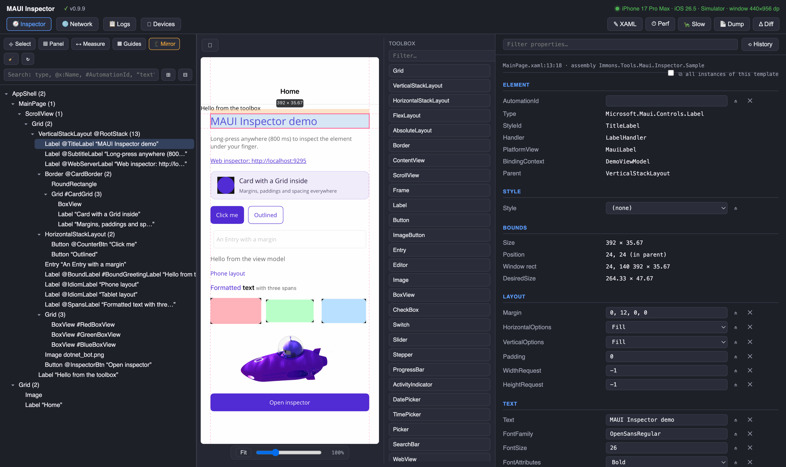

### The toolbox

Turn on **Mirror** and a toolbox appears next to the live screenshot: every MAUI built-in plus
**your app's own controls**, discovered by reflection (public `View` subclasses with a
parameterless constructor — marked `custom`). Drag a control onto the mirror: while you drag,
the container that would receive the drop is outlined with its type name, and the drop position
follows the cursor (above/below the neighbouring children in stack layouts).

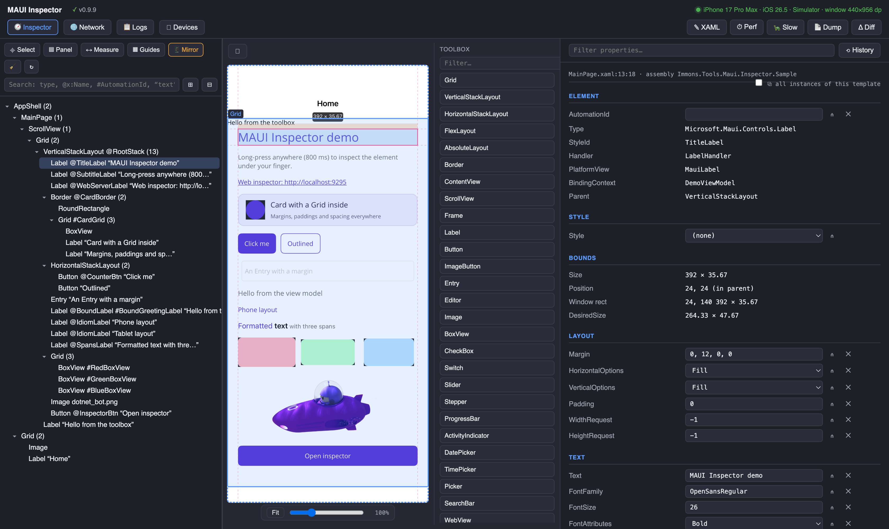

The `⛶` button expands the mirror into a full column — tree, mirror and properties side by
side — and `🗗` docks it back. The **Fit** button, zoom slider (25–300%, or pinch/Ctrl+scroll)
and drag-to-pan keep big tablet screenshots manageable; clicking, right-clicking and dropping
all stay accurate at any zoom, pan and device rotation.

### The context menu

Right-click a tree row — or right-click **directly on the mirror** (the element under the
cursor is hit-tested and selected) — for the full set of operations:

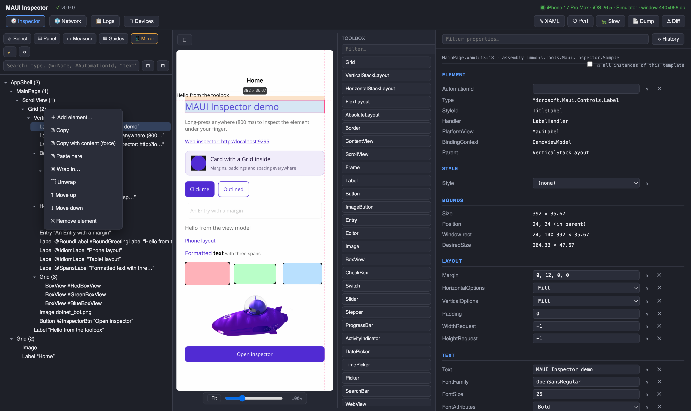

- **Add element…** opens a searchable catalog with a one-line description of every control.
- **Copy** / **Copy with content (force)** / **Paste here** — see below.
- **Wrap in…** puts the element inside a new container (Grid, Border, ScrollView, …) chosen
  from the same catalog, filtered to containers. The wrapper lands in the XAML around the
  element's markup, indentation included; editing the wrapper's properties rewrites only its
  opening tag.
- **Unwrap** pulls the element one level up: if it was its parent's only child the parent
  container disappears (your `<Grid><VerticalStackLayout/></Grid>` becomes just the stack);
  with siblings present, the element moves out to the grandparent instead.
- **Move up / Move down** reorder within the parent — dragging rows in the tree does the same,
  including dropping into a *different* parent (edges = before/after a sibling, middle = into
  the container).
- **Remove element** — also on the Delete/Backspace key.

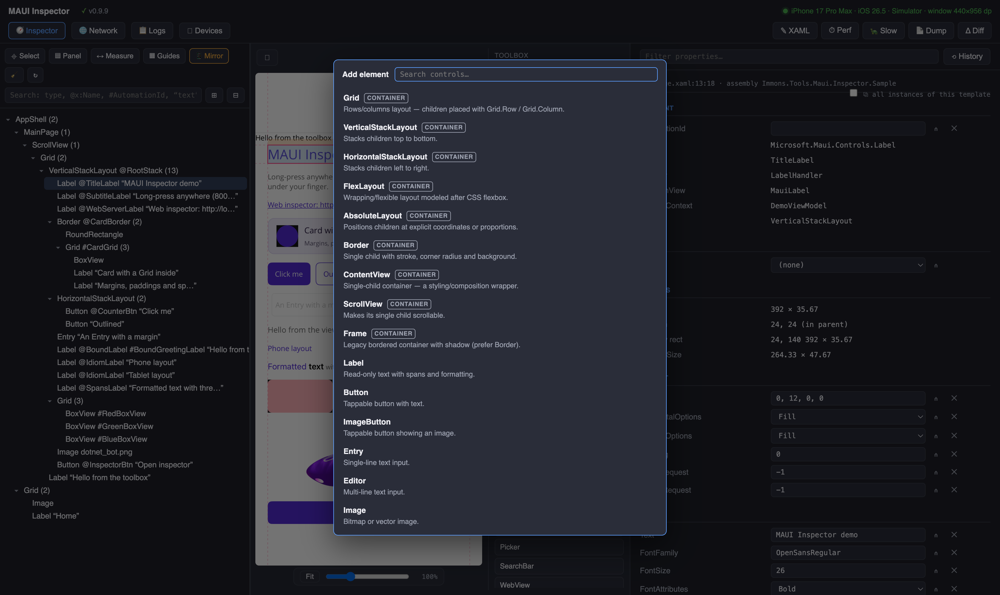

### Copy & paste

`Ctrl/Cmd+C` copies the selected element — its non-default property values and its whole
subtree; `Ctrl/Cmd+V` pastes into the selection (or its nearest container ancestor). The pasted
markup is written to the XAML as a complete nested block, custom controls included: their
`xmlns:` declarations are added to the root element automatically, reusing prefixes the file
already has. Custom controls are treated as *leaves* by default — their internal visual tree
belongs to them and is not duplicated. For wrapper-style controls that carry your content, use
**Copy with content (force)** (`Ctrl/Cmd+Shift+C`).

### History with undo & redo

Every edit — properties and structure alike — lands in the **Edit history**. `Ctrl/Cmd+Z` walks
the chain backwards like a classic editor: undone entries are struck through and leave the
chain, so repeated undo keeps going deeper instead of re-doing itself. `Ctrl/Cmd+Shift+Z` (or
`Ctrl+Y`) re-applies the most recently undone entry; making a new edit clears the redo branch.

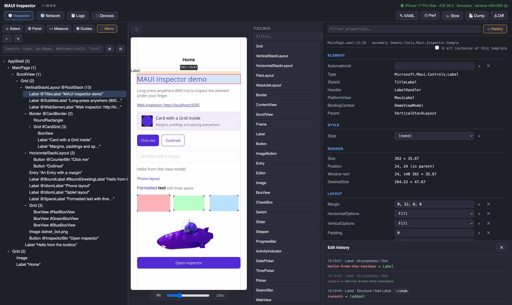

### Custom controls are first-class

Selecting one of your own controls adds a **“{Type} properties”** section listing the bindable
properties it declares (one section per type in the inheritance chain), with the same editors,
history, `{Binding}`/`{StaticResource}`/`{OnPlatform}` support and XAML write-back as the
built-in sections. `ImageSource` properties accept a bundled file name or an absolute URL.

### Durability

- With the SQLite storage package, structural edits **survive app restarts**: pending adds
  (with their edited attributes), removes, moves and wraps are re-applied when the page loads,
  matched by XAML source identity — until the XAML Updater has written them into the sources
  and they become plain markup.
- The XAML Updater applies structural operations with the same in-place, no-reformat policy as
  attribute edits: inserts are anchored to their parent and neighbours, later edits *upsert*
  the same snippet instead of duplicating it, moves relocate the element's exact span
  (re-indented for its new depth), and undo restores the removed text verbatim. Structural
  operations are only served to an updater that declares support for them, so an outdated tool
  can never misapply them.

## Getting started

### Packages

| Package | What it is | Install |
| --- | --- | --- |
| [`Immons.Tools.Maui.Inspector`](https://www.nuget.org/packages/Immons.Tools.Maui.Inspector) | The inspector itself — add it to your MAUI app. | `dotnet add package Immons.Tools.Maui.Inspector` |
| [`Immons.Tools.Maui.Inspector.Sync`](https://www.nuget.org/packages/Immons.Tools.Maui.Inspector.Sync) | The **XAML Updater** dotnet tool that writes panel edits back into your `.xaml` files (optional). | `dotnet tool install -g Immons.Tools.Maui.Inspector.Sync` |
| [`Immons.Tools.Maui.Inspector.Persistency`](https://www.nuget.org/packages/Immons.Tools.Maui.Inspector.Persistency) | SQLite storage backend — worth adding once recorded scenarios grow large (optional). | `dotnet add package Immons.Tools.Maui.Inspector.Persistency` |

```xml
<!-- Debug-only reference keeps the inspector out of release builds entirely -->
<PackageReference Include="Immons.Tools.Maui.Inspector" Version="0.9.12" Condition="'$(Configuration)' == 'Debug'" />
```

Targets `net10.0-ios`, `net10.0-android` and `net10.0-windows` (plus a no-op `net10.0`), MIT licensed.

### Enable the inspector

In `MauiProgram.cs` — ideally only for debug builds:

```csharp
using Immons.Tools.Maui.Inspector;

var builder = MauiApp.CreateBuilder();
builder.UseMauiApp<App>();

#if DEBUG
builder.UseMauiInspector(options =>
{
    options.EnableWebServer = true;                        // desktop web panel
    options.LongPressDuration = TimeSpan.FromMilliseconds(800);
    // options.WebServerPort = 9295;                       // force a port (default: auto)
    // options.LongPressTouchCount = 2;                    // avoid clashing with app long-presses
    // options.ShakeToOpen = true;                         // shake the device to open the overlay
    // options.MaxCapturedBodyBytes = 4 * 1024 * 1024;     // largest HTTP body kept for the Network view
});
#endif
```

The web server picks a free port from **9295–9309** and prints the URL to the platform console
and to the panel's Logs view:

```
[MauiInspector] web inspector listening on http://localhost:9296/ (auto-assigned)
```

`MauiInspector.WebServerUrl` returns the same URL at runtime (handy for a debug label in your app).

- **iOS simulator** — open that URL on the Mac.
- **Android emulator** — `adb forward tcp:<port> tcp:<port>` first (the XAML Updater tool does it for you).
- **Physical devices** — use the device IP (Android needs the `INTERNET` permission, present by default).

### Network traffic, mocks and logs (optional)

The **Network** and **Mocks** views only see traffic that flows through `MauiInspectorHttpHandler` —
a standard `DelegatingHandler` you add to your `HttpClient` pipeline. Everything routed through it
is recorded with full request/response bodies and can be mocked, delayed, failed or paused at
a breakpoint; anything that bypasses it stays invisible to the inspector.

**Plain `HttpClient`** — the parameterless constructor brings its own `HttpClientHandler`:

```csharp
using Immons.Tools.Maui.Inspector;

var client = new HttpClient(new MauiInspectorHttpHandler());
```

**Keeping your existing handler chain** — pass it as the inner handler. The inspector sees the
request first (so a mock short-circuits the whole chain), then your handlers run unchanged:

```csharp
var client = new HttpClient(
    new MauiInspectorHttpHandler(
        new AuthTokenHandler(new HttpClientHandler())));
```

**`IHttpClientFactory` / typed clients / Refit** — register it with
`MauiInspectorHttpHandler.ForClientFactory`. Do **not** `new` the handler here: the factory
requires `InnerHandler` to be left unassigned and the constructors assign it, so
`AddHttpMessageHandler(() => new MauiInspectorHttpHandler())` throws
an `InvalidOperationException` on the first request. `ForClientFactory()` leaves it unassigned:

```csharp
var api = builder.Services.AddHttpClient<GitHubApiClient>(
    client => client.BaseAddress = new Uri("https://api.github.com"));

#if DEBUG
api.AddHttpMessageHandler(MauiInspectorHttpHandler.ForClientFactory);
#endif
```

The same `IHttpClientBuilder` call works for named clients (`AddHttpClient("api")`) and
Refit registrations (`AddRefitClient<IGitHubApi>()`). Register it **last** so the inspector
sits outermost and records exactly what your other handlers (auth headers, retries) produced.
The `#if DEBUG` guard matches the Debug-only `PackageReference` from
[Packages](#packages) — release builds compile without the inspector at all.

**Logs** — stream `ILogger` output into the panel's Logs view:

```csharp
// register AFTER any ClearProviders()
builder.Logging.AddMauiInspector();
```

### Manual control

```csharp
MauiInspector.Show();          // open the on-device overlay
MauiInspector.Hide();
MauiInspector.Toggle();
MauiInspector.Inspect(someVisualElement);  // open with a specific element selected
```

### Troubleshooting the connection

**The startup log says `self-probe on port N failed: …`** — the server bound the port but could
not reach itself over loopback; the message carries the underlying reason. Before 0.9.9 this was
misreported as `port N is shadowed by another process`, and the most common trigger was Android's
cleartext policy (`Cleartext HTTP traffic to 127.0.0.1 not permitted` with `targetSdk` 28+) —
0.9.9 probes with a handler that policy doesn't apply to, so if you still see it, take the quoted
reason at face value.

**The startup log says `port N is shadowed by another process`** — this one is real: something
answered the probe with a wrong instance id. Usually a previous run of the same app is still
alive; kill it or let the auto-assign pick the next port.

**The browser on your desktop can't connect (or spins forever) even though the app says
`web inspector listening`** — the URL is served from *inside* the app, so the browser's route to
it is what usually breaks:

- **Android emulator** — the emulator has its own network stack; without
  `adb forward tcp:<port> tcp:<port>` nothing on the host answers `localhost:<port>`.
- **A connection that hangs instead of being refused** is typically a *different* process holding
  the port on your machine. iOS **simulator** apps run as host processes and hold their inspector
  ports; when iOS suspends one in the background, its socket still accepts connections but never
  responds — and an `adb forward` to the same port number silently loses that fight. Check with
  `lsof -nP -iTCP:9295-9309 -sTCP:LISTEN` (macOS), then either foreground/kill the stale
  simulator app, or forward to a shifted host port and browse to that:
  `adb forward tcp:9305 tcp:9295` → open `http://localhost:9305`.
- **iOS simulator** — bring the app to the foreground: iOS suspends a backgrounded app together
  with its HTTP server, so the panel shows `app in background` and requests time out.
- **Physical devices** — `localhost` won't do; use the device's IP (Android additionally needs
  the `INTERNET` permission, present by default) or, on Android, `adb forward` over USB.

## Supported platforms

| Platform | TFM | Activation |
| --- | --- | --- |
| Android (API 21+) | `net10.0-android` | long-press (1–2 fingers), shake |
| iOS 15+ | `net10.0-ios` | long-press (1–2 fingers), shake |
| Windows (WinUI 3) | `net10.0-windows10.0.19041.0` | `Ctrl+Shift+I` or touch press-and-hold |

The `net10.0` target compiles to no-ops, so referencing the library never breaks other targets.
The Windows target only builds on Windows machines (guarded in the csproj).

## Features

### Inspecting

- **Visual tree** — the whole window, auto-expanded to the selection, with type names, `x:Name`/`StyleId`, text snippets and child counts. Search by type, `@x:Name`, `#AutomationId` or text (spans included); arrow keys walk the tree.
- **Element picking** — with select mode (⌖) a single tap on the device picks an element; the hit test walks the real MAUI tree (through Shell intermediaries) in paint order.
- **Box model overlay** — margin (orange), padding (green) and content (blue) fills, dashed alignment guides and a dimensions badge, drawn over the live app.
- **Property sheet** — grouped sections (Element, Style, Bounds, Layout, Text, Appearance, Transform, Interaction, Accessibility, Control, ViewModel, All properties) with color swatches, the XAML source location, and a per-property filter.
- **Layout Explorer** — the selected container's children drawn to scale (with `Grid` cells); click a child to select it.
- **Debug paint (▦ Guides)** — Flutter-style outlines of every visible element, color-cycled by depth.
- **Measure distances (↔)** — pick a second element and get Figma-style gaps or edge offsets (see [badges](#measure-mode-badges)).
- **Mirror (📱)** — live device screenshots in the browser; click the image to select the element under the cursor.
- **Console dump / diff** — the whole tree with bounds, margins, paddings, spacings, sibling gaps, fonts and colors, ready to compare against a Figma design; **Δ Diff** stores a baseline and shows exactly which lines changed.
- **Accessibility** — editable `SemanticProperties` plus a WCAG contrast check against the effective background.
- **Performance (⏱)** — live fps / average / worst frame time; **🐢 Slow** runs all animations 5× slower.

### Editing

- **Live editing** — text/number fields, switches and pickers for anything with a public setter: `FontSize`, `Margin`, `Padding`, `Text`, colors (`#RRGGBB`, `#AARRGGBB` or named), `Thickness` (`8`, `8,4`, `8,4,8,4`), enums, `LayoutOptions`, `Keyboard`, `Image.Source`… The highlight re-measures after every change.
- **Markup extensions** — type `{Binding X}`, `{StaticResource Y}`, `{OnPlatform …}` or your own extension (`{extensions:Translate Key}`) into any editor and it is applied for real; a custom extension that cannot be instantiated is kept as a XAML-only edit instead of landing as literal `{…}` text.
- **Suggestions** — text editors offer what actually fits the property: registered font aliases for `FontFamily`, and `{StaticResource Key}` type-ahead over the resources whose value matches the property type (colors for `TextColor`, doubles for `FontSize`, strings for `Text`…). The **⋔** button opens a small per-platform / per-idiom form (iOS · Android · WinUI, Phone · Tablet · Desktop); the applied expression is shown next to the value and remembered across app restarts.
- **Binding-aware** — bound properties show a `⛓ {Binding …}` badge, and literal edits on them stay runtime-only so the binding expression in your XAML is never overwritten by a constant.
- **Styles** — the current `Style` resolved to its resource key with all setters listed, and a picker to apply any other reachable style (local values are cleared so the style actually takes effect).
- **Spans** — a `Label`'s `FormattedText` expands into per-span sections with add/remove, and can be created from the plain `Text`.
- **Grid** — editable row/column definitions (`Auto`, `*`, `2*`, `48`) with add/remove, plus `Grid.Row/Column/RowSpan/ColumnSpan` on children.
- **ViewModel** — the selected element's `BindingContext` properties, editable for simple types (in-memory only).
- **Edit history** — every applied edit logged old → new, with one-click undo.

### Network

- **Recording** — method, status, timing, size and full request/response bodies for every call through `MauiInspectorHttpHandler`, with a filter over method/URL/status/tag and a **🧹 Clear** button to start from a clean slate.
- **Mock rules** — method + URL pattern (substring or `*` wildcard; the most specific rule wins) → replace request/response body, force a status, delay, simulate timeout/network error, or answer entirely without the network.
- **Scenarios** — named rule groups; a rule can belong to many, one picker switches the active one, and rules of the active scenario outrank global ones. The same picker has an **off** entry that suspends mocking entirely — global rules included — so you can compare against the real API and switch back without touching a single rule. It is remembered across restarts.
- **Recording into a scenario (⏺)** — record a flow, stop, and every unique call becomes a no-network rule tagged with the new scenario.
- **Breakpoints (⏸)** — pause requests and/or responses matching a filter, edit body/status, continue or abort.
- **Portable** — the whole state (scenarios + rules) exports/imports as one JSON file and persists on the device between runs; the browser also keeps a per-app backup and restores it after a reinstall.
- **Scenarios reach your code** — `MauiInspector.IsScenarioActive("offline")` / `MauiInspector.ActiveScenario` let debug builds fake what HTTP interception cannot see (an MSAL sign-in, a native SDK, a sensor), so one picker can put the whole app offline.

### Multi-device

- **🖧 Devices** — scan localhost (or add `host:port`) to find other instances of the same app, then every property edit, structural action and mock-rule change is mirrored to the checked targets.
- Targets are addressed by **XAML source identity**, not by element ids — one edit reaches every device rendering that line, including every instance of a `DataTemplate`.
- When a device renders a **different template or a different page variant** (an `AdaptiveTemplateView`-style control, `OnIdiom` layouts, or whole pages picked per form factor such as `Main_iPhone_Page` / `Main_iPad_Page`), that source line does not exist there, so the edit falls back to an identifier of the same type: **`AutomationId` first** (it exists to identify one element), then `StyleId` — which is also what MAUI fills from `x:Name`. The fallback is confined to the **counterpart page**: page type names are normalised by stripping form-factor tokens, so `Main_iPad_Page`, `Main_Android_Tablet_Page` and `MainPage` all count as `Main` and a same-named element on an unrelated screen is never touched.
- `StyleId` is a **weak key** — it doubles as the MAUI CSS `#id` selector and nothing keeps it unique, so two unrelated controls can share one. Several matches are therefore accepted only when they all come from the **same XAML line** (the rows of one `DataTemplate`, which is exactly what fan-out should hit); matches from different lines are a name collision and are refused rather than guessed. No match, or an ambiguous one, is reported as `—`.
- **⧉ all instances of this template** (next to the source path) re-applies the edit locally through the same matcher, so all rows of a `DataTemplate` update at once, not just the selected one.

## UI tests (Maestro, Appium)

A UI test needs two things from the inspector: **which rules exist** and **which scenario is
active** — decided before the app makes its first call, because a version check or a token refresh
fires during startup, long before a test step could run.

**1. Ship the rules with the test build.** Record a flow in the panel, hit **⬆ Export**, and add the
file to the app project:

```xml
<MauiAsset Include="inspector-rules.json" LogicalName="inspector-rules.json" />
```
```csharp
builder.UseMauiInspector(options =>
{
    options.SeedRulesAsset = "inspector-rules.json";   // loaded only when the app has no rules
});
```

Because it travels inside the package, it survives `clearState` / a fresh install — which is what a
CI run does on every execution. It is imported **only when the rule registry is empty**, so a
developer's own rules are never overwritten.

**2. Pick the scenario per test with a launch argument.**

```yaml
# Maestro
- launchApp:
    clearState: true
    arguments:
      inspectorScenario: "qa-error"
```
```python
# Appium — iOS
options.process_arguments = {'args': ['-inspectorScenario', 'qa-error']}
# Appium — Android
options.optional_intent_arguments = '--es inspectorScenario qa-error'
```

| Value | Effect |
| --- | --- |
| a scenario name | that scenario becomes active, mocking on |
| `none` | global rules only |
| `off` | mocking suspended entirely, the app talks to the real API |
| *not passed* | **unchanged** — whatever the app had stored, exactly as without this feature |

The argument is applied **in memory only**: a test run never overwrites the scenario a developer
picked in the panel. It also outranks the `activeScenario` recorded in the seed file. Use
`inspectorRules` to name a different bundled file per test, when one build carries several sets.

**3. Change the scenario mid-flow over HTTP** (the panel's own API — see below):

```javascript
// Maestro runScript
http.post('http://localhost:9295/api/mock/rules/scenario', { body: JSON.stringify({ name: 'qa-offline' }) })
```

Pin the port for tests (`options.WebServerPort = 9295`) — the default scans 9295–9309. Android
emulators need `adb forward tcp:9295 tcp:9295` first; physical devices need the device IP.

## HTTP API

Everything the panel does goes through this API, so anything the panel can do, a script can do too.
All POST bodies are JSON. Base URL is the one printed at startup (`MauiInspector.WebServerUrl`).

**Inspecting**

| Method & path | What it does |
| --- | --- |
| `GET /api/ping` | App name, device, instance id and the inspector's package version |
| `GET /api/tree` | Visual tree as JSON |
| `GET /api/dump` | The tree as plain text |
| `GET /api/selection` | Currently selected element with its properties |
| `POST /api/element/{id}/select` | Select an element |
| `POST /api/element/{id}/property` | Set a property — `{section, name, value}` or `{section, name, clear: true}`; the value accepts `{Binding …}`, `{StaticResource …}`, `{OnPlatform …}` |
| `POST /api/element/{id}/action` | Structural action (hide, remove, duplicate…), same body shape |
| `GET /api/history` · `POST /api/history/undo` | Applied edits; undo the last one |
| `GET /api/changes` | Edits pending write-back to XAML |
| `GET /api/measure` · `POST /api/clear` | Distance between two elements; clear the measurement |
| `GET /api/screenshot` · `POST /api/select-at` | Device mirror image; select by screen coordinates |

**Toggles** — each takes `POST {on: bool}`: `/api/measure-mode`, `/api/select-mode`, `/api/overlay`,
`/api/debug-paint`, `/api/perf`, `/api/slow-animations`, `/api/wysiwyg`.

**Network**

| Method & path | What it does |
| --- | --- |
| `GET /api/network` | Recorded calls (newest first), without bodies |
| `GET /api/network/body?seq=N` | Request and response body of one call |
| `POST /api/network/clear` | Drop the recorded calls |
| `GET /api/intercept` | Breakpoint config and the calls currently paused |
| `POST /api/intercept/config` | `{req, resp, filter}` — which phases pause, on which URLs |
| `POST /api/intercept/resume` | `{id, body?, status?}` — continue a paused call, optionally rewritten |
| `POST /api/intercept/abort` | `{id}` — fail a paused call |

**Mocks**

| Method & path | What it does |
| --- | --- |
| `GET /api/mock/rules` | Rules, scenario list, active scenario, `mockingEnabled`, recording state |
| `POST /api/mock/rules/save` | Add (`id: 0`) or replace (`id > 0`) one rule |
| `POST /api/mock/rules/delete` | `{id}` |
| `POST /api/mock/rules/enable` | `{id, enabled}` — toggle one rule |
| `POST /api/mock/rules/import` | `{scenarios, activeScenario, rules}` — a whole set in one write |
| `POST /api/mock/rules/mocking` | `{enabled}` — master switch (the picker's **off**) |
| `POST /api/mock/rules/scenario` | `{name}` — activate a scenario (`""` = global rules only) |
| `POST /api/mock/rules/scenario/add` · `/remove` | `{name}` — manage the scenario registry |
| `POST /api/mock/record/start` · `/stop` · `/cancel` | Record traffic into a new scenario |

**Multi-device** — `POST /api/broadcast/property` and `/api/broadcast/action` take
`{source, elementName, automationId, type, page, section, name, value}` and apply the edit to this
app on every connected device, matched by XAML source identity with the name/page fallbacks.

**Logs** — `GET /api/logs` returns what `builder.Logging.AddMauiInspector()` collected.

## Storage backend

By default everything the inspector persists — mock rules, scenarios, breakpoints, applied
expressions — lives in `Preferences`. That is dependency-free and fine for a handful of rules, but
it stores the whole rule set as **one value**, so every change re-serialises all of it. Recording a
real app's traffic gets you there quickly: 190 rules with response bodies is ~1.4 MB rewritten on
every toggle.

`Immons.Tools.Maui.Inspector.Persistency` swaps that for SQLite, where a rule is a row:

```csharp
builder
    .UseMauiInspector(options => { /* … */ })
    .UseMauiInspectorPersistency();          // ← one line, next to UseMauiInspector
```

Rules, scenarios and breakpoints stored by an earlier run are migrated on first start and the old
Preferences copy is removed; pass `migrateFromPreferences: false` to skip that. Applied expressions
are the exception: they are keyed by an opaque hash and `Preferences` cannot be enumerated, so they
are not migrated — they land in SQLite the next time you apply an edit. The database defaults to
`maui-inspector.db3` in the app data folder; pass a path to put it elsewhere.

## Offline testing

HTTP interception covers everything that goes through `MauiInspectorHttpHandler`, but not what
happens outside your process — an MSAL/OAuth sign-in runs in the system browser, and libraries with
their own `HttpClient` bypass the handler until you route them through it
(`.WithHttpClientFactory(…)` for MSAL). The scenario API bridges that gap:

```csharp
#if DEBUG
if (MauiInspector.IsScenarioActive("offline"))
{
    // skip the real sign-in; every API call is answered by the scenario's rules
    var user = await _users.CreateUser("offline-token");
    return new AuthenticationResult(AuthenticationStatus.Authenticated, user);
}
#endif
```

Recipe: **⏺ Record** a full flow once online → **⏹ Stop** and name it `offline` → add the snippet
above → from then on selecting that scenario runs the whole app with no network and no login.

## Measure mode badges

After enabling `↔` and picking a second element, distance labels appear on the overlay:

| Badge | Meaning |
| --- | --- |
| `W × H` (dark) | Size of the **primary** (first selected) element — not a distance. |
| `←n→` | Free **horizontal gap** between the two elements (outer spacing). |
| `↑n↓` | Free **vertical gap** between the two elements (outer spacing). |
| `L n` | Offset between the **left** edges of primary and compare. |
| `R n` | Offset between the **right** edges. |
| `T n` | Offset between the **top** edges. |
| `B n` | Offset between the **bottom** edges. |

**When which ones show**

- Side-by-side (no X overlap): `←n→` plus `T` / `B` if those edges are not aligned.
- Stacked (no Y overlap): `↑n↓` plus `L` / `R` if those edges are not aligned.
- Diagonal (no overlap on either axis): `←n→` and `↑n↓`.
- Nested / intersecting on both axes: `L` / `R` / `T` / `B` (no outer gap).

Values are in **dp**. Aligned edges (delta ≈ 0) are omitted.

## WYSIWYG: write edits back to your XAML (XAML Updater)

The inspector can act as a real WYSIWYG editor: edits made in the web panel (or on the
device) are written back into your XAML source files.

1. In debug builds MAUI records the XAML source location (file + line) of every element —
   `UseMauiInspector` enables this automatically. The panel shows it above the
   properties (e.g. `MainPage.xaml:26:14`). **Requires runtime/XamlC inflation** — remove
   `<MauiXamlInflator>SourceGen</MauiXamlInflator>` from the app project for Debug.
2. Install the companion tool once, then run it from your app's source folder:

   ```bash
   dotnet tool install -g Immons.Tools.Maui.Inspector.Sync   # once
   cd path/to/your/app
   maui-inspector-sync
   ```

   The tool ships as a **.NET global tool** (`net10.0`), so `maui-inspector-sync` is on your
   `PATH` right after installing — on a fresh machine open a new terminal first, and if the
   command is still not found add `~/.dotnet/tools` (Windows: `%USERPROFILE%\.dotnet\tools`)
   to `PATH`. Housekeeping:

   ```bash
   dotnet tool update    -g Immons.Tools.Maui.Inspector.Sync   # newer version
   dotnet tool uninstall -g Immons.Tools.Maui.Inspector.Sync   # remove
   dotnet tool list      -g                                    # what is installed
   maui-inspector-sync --help                                  # all options
   ```

   Prefer not to install it globally? `dotnet tool install --local` (with a
   `dotnet-tools.json` manifest in the repo) works too — then run it as
   `dotnet maui-inspector-sync`, and everyone on the team gets the same version.

   Zero configuration: it scans localhost ports 9295–9309 for a running inspector, sets up
   `adb forward` automatically when adb is available (Android emulators), prints which
   device it found and watches the current folder. `--app` / `--src` override when needed;
   the panel header shows `XAML Updater ✓` once the tool is connected (and the exact
   command to run when it is not).

3. Toggle **✎ XAML** in the panel header. From now on every applied edit
   (FontSize, colors, margins, styles, span/shadow attributes, `Grid.Row`, `{Binding …}`,
   `{OnPlatform …}`…) is patched into the right attribute of the right tag — plain-text edits,
   no reformatting. Only the latest value per attribute is written; the toggle can be flipped
   on/off at any time.
4. Pair it with your IDE's **XAML Hot Reload** and the loop closes: web edit → file save →
   hot reload → app updates.

Safety: the XAML Updater verifies the element name at the recorded location and skips (with a warning)
when the file has drifted — after editing XAML by hand, restart the app to refresh locations.
Edits of objects that don't come from XAML (created in C#) are not recorded.

## Options

| Option | Default | Description |
| --- | --- | --- |
| `EnableWebServer` | `false` | Embedded web panel for desktop browsers. |
| `WebServerPort` | `null` (auto) | `null` picks a free port from 9295–9309; a value forces that exact port. |
| `Activation` | `LongPress` | `LongPress` or `None` (manual `Show()` only). |
| `LongPressDuration` | 900 ms | Hold time before the overlay opens (iOS/Android). |
| `LongPressTouchCount` | 1 | 1 or 2 fingers. |
| `ShakeToOpen` | `false` | Shake the device to toggle the overlay. |
| `PanelHeightFraction` | 0.45 | On-device panel height as a fraction of the window. |
| `SeedRulesAsset` | `null` | Rule set (a panel export added as `MauiAsset`) imported when the app starts with no rules — see [UI tests](#ui-tests-maestro-appium). |
| `MaxCapturedBodyBytes` | 4 MB | Largest HTTP body kept for the Network view; bigger ones are still logged and mockable, only the body is dropped. |

## How it works

- `UseMauiInspector` appends to `WindowHandler.Mapper`, so every window gets an inspector when its handler connects.
- Android: the activity's `Window.Callback` is wrapped to observe (never consume) touches for long-press detection; overlay layers are added to the `DecorView`. iOS: a non-cancelling `UILongPressGestureRecognizer` on the `UIWindow`; layers are added as window subviews. Windows: a `KeyboardAccelerator` + `Holding` handler on the root content.
- The overlay itself is regular MAUI UI (`ToPlatform`-hosted), deliberately detached from the page tree, so it never shows up in the inspected tree and works over any page, Shell or modal.
- The web panel is served by an `HttpListener` inside the app; the client is a dependency-free static page embedded in the assembly.
- Element bounds come from the native views (`GetLocationInWindow` / `ConvertRectToView` / `TransformToVisual`), so scrolling and transforms are reflected.
- HTTP interception is a plain `DelegatingHandler` — no proxy, no system certificates, nothing to trust.

## Known limitations

- The soft keyboard can cover the on-device panel while typing on phones — drag the panel up by its header, or use the web panel.
- Full trimming/AOT of **release** builds may strip property setters used by the editors; the tool is intended for debug builds (wrap the registration in `#if DEBUG`).
- Native-only views (non-MAUI subviews) are not listed in the tree.
- Breakpoints hold a request until you continue it — mind your `HttpClient.Timeout`.
- Binary or very large (>128 KB) HTTP bodies are not captured and cannot be recorded into scenarios.
- The Windows implementation compiles only on Windows and has not been exercised as thoroughly as iOS/Android yet.

